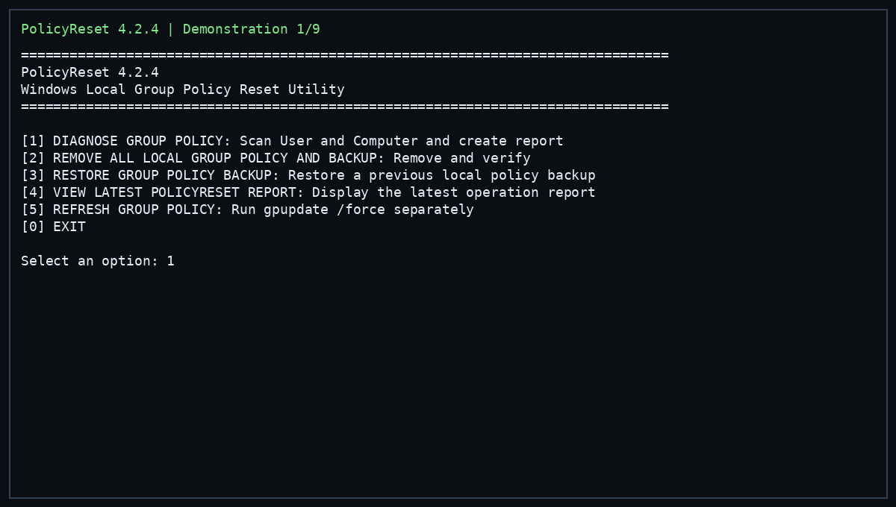

# PolicyReset

> Windows Local Group Policy diagnostic, backup, reset and verification utility.


## Overview

PolicyReset is a terminal-only Windows utility for inspecting, backing up, removing and restoring **Local Group Policy** for the current computer and user.

The project is deliberately narrow in scope. Its main reset operation removes the two Windows Local Group Policy stores and the four targeted Registry policy roots used by the original script:

```text
%WinDir%\System32\GroupPolicy
%WinDir%\System32\GroupPolicyUsers
```

PolicyReset does **not** attempt to remove, bypass or disable policy controlled by Active Directory, Microsoft Entra ID, MDM, Intune or other remote organisational management systems.

## Demonstration



The GIF above is a **replay of the captured Windows terminal validation session for PolicyReset 4.2.4**. It predates the 4.3.0 Registry reset extension and the 4.3.1 protected-Registry cleanup fix. It reproduces the real workflow and terminal output used during testing. It is not a live screen recording.

The captured run demonstrated:

```text
Diagnosis
  Local Group Policy stores: absent
  Applied Group Policy objects reported by gpresult: 0

Reset
  Backup created before modification
  Local Group Policy stores: already clear
  gpupdate /force: deliberately not run

Refresh
  gpupdate /force: successful

Restore
  Backup selected and restored
  Local Group Policy stores: verified
  gpupdate /force: successful

Final diagnosis
  Local Group Policy stores: absent
  Applied Group Policy objects reported by gpresult: 0
```

## Why PolicyReset does not run `gpupdate /force` during reset

Removing Local Group Policy and refreshing Group Policy are intentionally separate operations.

The reset operation is:

```text
Backup
   ↓
Remove Local Group Policy stores
   ↓
Remove targeted Registry policy roots
   ↓
Verify both layers
   ↓
Write result report
```

It does **not** call:

```powershell
gpupdate /force
```

`gpupdate /force` explicitly reapplies available User and Computer Group Policy. Running it automatically as part of a removal operation would mix two different responsibilities and could reapply policy from sources that remain available to Windows.

PolicyReset therefore provides Group Policy refresh as a separate explicit menu operation.

## Main menu

```text
[1] DIAGNOSE GROUP POLICY: Scan User and Computer and create report
[2] REMOVE ALL LOCAL GROUP POLICY AND BACKUP: Remove and verify
[3] RESTORE GROUP POLICY BACKUP: Restore a previous local policy backup
[4] VIEW LATEST POLICYRESET REPORT: Display the latest operation report
[5] REFRESH GROUP POLICY: Run gpupdate /force separately
[0] EXIT
```

Every operation returns to the main menu. When PolicyReset is launched directly from an existing PowerShell session, `[0] EXIT` closes PolicyReset but leaves the parent PowerShell session open. When `PolicyReset.pyw` is launched through the Windows `.pyw` association, PolicyReset opens a dedicated PowerShell console and `[0] EXIT` closes that console after the application terminates.

## Core workflow

### 1. Diagnose

PolicyReset collects a baseline before any modification:

- Current user and computer information.
- Administrator status.
- Active Directory, Microsoft Entra ID and enterprise-join indicators.
- MDM discovery information.
- Presence of management-related Registry locations.
- Local Group Policy store status.
- Registry values found under known policy-related locations.
- Presence of the four targeted Registry policy roots.
- `gpresult` reports in text, HTML and XML formats.
- Applied Group Policy object names from the structured XML report.

The diagnosis writes a machine-readable `diagnostic.json` report.

### 2. Remove Local Group Policy

The reset operation first creates a backup and then removes only the fixed Local Group Policy stores:

```text
%WinDir%\System32\GroupPolicy
%WinDir%\System32\GroupPolicyUsers
```

The operation verifies the directories afterwards and reports:

```text
Removed successfully
Removal failed
Status
Stores remaining
```

When a store cannot be removed normally, the utility can attempt a forced removal of that **specific local Group Policy store**.

The reset operation deletes these four Registry policy roots recursively after backup, matching the Registry scope of the original script. For protected Registry keys, forced removal first uses Windows security APIs through PowerShell to temporarily grant only the local Administrators group the required access, then performs the deletion. The original security descriptors are restored on the remaining keys if the permission-assisted deletion fails. It does not grant permissions to Everyone, delete arbitrary Registry locations, or run `gpupdate /force`.

### 3. Restore a backup

Restore replaces the current Local Group Policy stores with the state recorded in the selected backup.

A safety backup is created before the restore operation. The resulting Local Group Policy store state and targeted Registry policy root state are verified against the selected backup and a dedicated `restore.json` report is created.

Registry exports created during backup are imported during restore so the selected backup can restore both layers.

### 4. Refresh Group Policy

The refresh operation is explicit:

```powershell
gpupdate /force
```

Its output is stored in the session directory and the operation creates a dedicated `gpupdate.json` report.

## `gpresult` and language independence

Windows command output can be localised. PolicyReset therefore does not rely on English text in `gpresult` to determine which Group Policy objects are applied.

Diagnosis produces:

```text
gpresult.txt
gpresult.html
gpresult.xml
```

The XML report is parsed structurally by traversing the `ComputerResults` and `UserResults` sections and extracting GPO names without depending on the Windows display language.

## Registry policy values are reported separately

A value located under a path containing `Policies` is not automatically treated as proof that a Local Group Policy store still exists.

PolicyReset therefore reports Registry findings separately from the Local Group Policy store status.

For example:

```text
Local Group Policy stores
  [OK] Both local stores are absent.

Registry policy values found: 5
```

This prevents the tool from confusing application policy, Windows policy Registry data and the physical Local Group Policy stores.

## Administrative execution

PolicyReset requires administrator privileges because Local Group Policy stores are system locations.

### Double-click

The application file is:

```text
PolicyReset.pyw
```

When launched by Windows through the `.pyw` association, the bootstrap requests UAC elevation and opens a persistent PowerShell console running PolicyReset.

### Existing PowerShell

From PowerShell, use the console Python interpreter explicitly:

```powershell
python.exe .\PolicyReset.pyw
```

This keeps the application in the current terminal when the session is already elevated. If the PowerShell session is not elevated, PolicyReset requests elevation and continues in a new administrator PowerShell console.

## Safety model

PolicyReset is intentionally restrictive around destructive operations.

### Fixed targets

The reset uses fixed targets only:

```text
%WinDir%\System32\GroupPolicy
%WinDir%\System32\GroupPolicyUsers
HKCU\Software\Policies
HKCU\Software\Microsoft\Windows\CurrentVersion\Policies
HKLM\SOFTWARE\Policies
HKLM\SOFTWARE\Microsoft\Windows\CurrentVersion\Policies
```

The four Registry roots are deleted recursively after backup. There is no arbitrary path input for the destructive reset.

### Backup before modification

Before reset or restore operations, PolicyReset creates a session backup under:

```text
C:\ProgramData\PolicyReset\Sessions\
```

The session may contain:

```text
LocalGroupPolicy\
Registry\
backup-manifest.json
```

### Explicit confirmation

Destructive operations require an explicit `Y` confirmation.

### Remote policy boundary

The utility does not remove or bypass:

```text
Active Directory policy
Microsoft Entra ID policy
MDM / Intune policy
Other remote organisation-controlled policy
```

## Runtime data

All application-generated backups, reports and logs are stored outside the source tree:

```text
C:\ProgramData\PolicyReset\
├── Logs\
└── Sessions\
```

Keeping runtime data outside the repository prevents user-specific data and machine state from being committed accidentally.

## Project structure

```text
PolicyReset/
├── .gitignore
├── AUDIT.md
├── CHANGELOG.md
├── LICENSE
├── PolicyReset.pyw
├── README.md
├── pyproject.toml
├── assets/
│   └── demo.gif
├── docs/
│   └── SECURITY.md
└── tests/
    └── test_source.py
```

## Requirements

- Windows with Local Group Policy support.
- Python 3.10 or newer.
- Administrator privileges.
- PowerShell available on the system.

No third-party Python packages are required.

## Testing

Run the source-level test suite from the repository root:

```powershell
python -m unittest discover -s tests -v
```

The tests cover, among other checks:

- Python syntax validity.
- Terminal-only operation.
- `.pyw` bootstrap and UAC elevation path.
- Fixed Local Group Policy targets.
- Separation of reset and `gpupdate /force`.
- Language-independent `gpresult` XML parsing.
- Correct handling of already-absent stores.
- Backup and restore behaviour.
- Operation report generation.
- Local function reference integrity.

## Example result

When the Local Group Policy stores are already absent, the reset reports:

```text
==============================================================================
LOCAL GROUP POLICY ALREADY CLEAR
==============================================================================

Local Group Policy
  Removed successfully: 0
  Removal failed: 0
  Status: Already clear
  Stores remaining: 0

Group Policy refresh
  gpupdate /force: Not run during reset
  The reset deliberately does not reapply Group Policy.

Verification
  [OK] Both local Group Policy stores are absent.
```

When stores are actually removed, the final status reflects the real removal and verification result rather than treating an already-absent directory as a successful deletion.

## Design principles

PolicyReset follows a small set of operational principles:

1. **Separate diagnosis from remediation.**
2. **Back up before changing system state.**
3. **Use fixed destructive targets.**
4. **Verify the post-operation state.**
5. **Do not confuse Registry policy values with Local Group Policy stores.**
6. **Keep Group Policy refresh explicit and separate from reset.**
7. **Avoid language-dependent parsing where structured output is available.**
8. **Keep runtime data outside the repository.**

## Limitations

PolicyReset is a Local Group Policy tool. It does not claim to remove policy delivered by domain controllers, Microsoft Entra ID, MDM, Intune or other organisation-controlled systems.

Registry policy values under the four targeted roots are part of the core reset operation. They are counted before and after removal, and the reset is only reported as successful when no targeted Registry root remains. Registry data outside those four fixed roots is not removed.

A restart may be appropriate after a real Local Group Policy removal before performing final application-level verification.

## Security

See [`docs/SECURITY.md`](docs/SECURITY.md) for the project security model and destructive-operation boundaries.

## Audit

See [`AUDIT.md`](AUDIT.md) for implementation audit notes and the current design decisions.

## Licence

This project is licensed under the MIT License. See [`LICENSE`](LICENSE).
